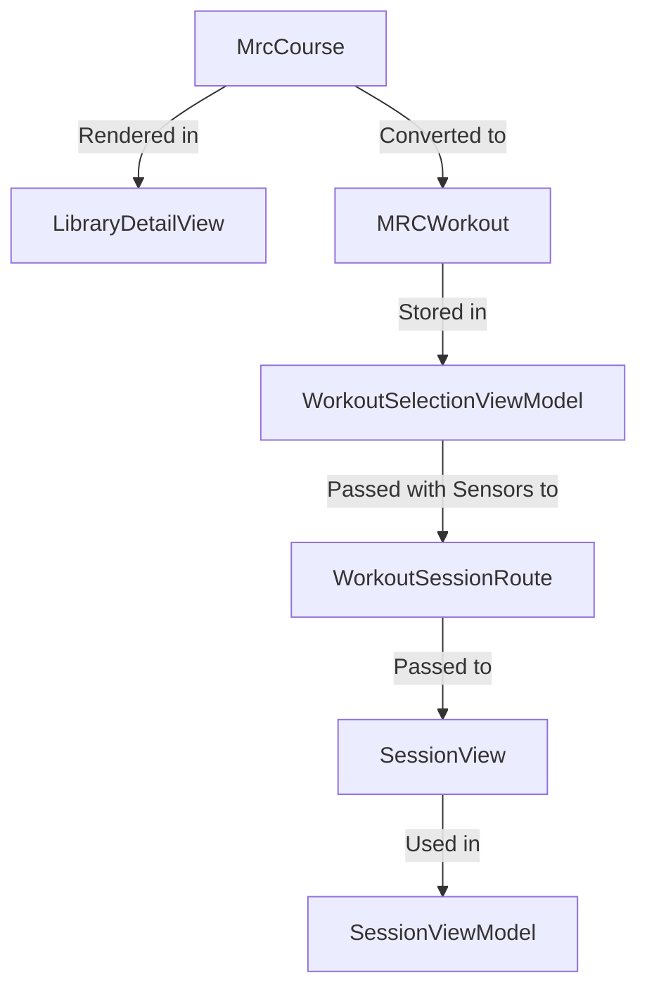
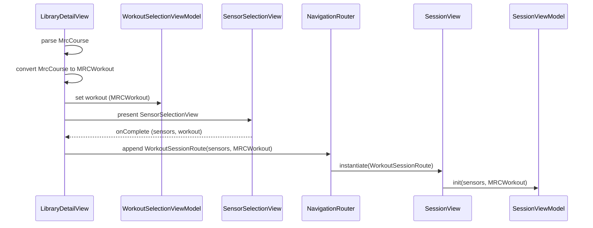

# MRC Data Flow and Handling

The codebase demonstrates a clear separation of concerns regarding workout data handling. `MrcCourse` serves as the raw, descriptive data structure used primarily for display within the `LibraryDetailView`. When a user initiates a session, `MrcCourse` is transformed into an `MRCWorkout` object, which is the structured format required by the active session components.

### Data Flow and Transformation
1.  **Display Phase (`LibraryDetailView`):** The view receives an `MrcCourse` (either directly or via the `LibraryDetailViewModel`) and uses it to populate UI elements like `headerSection`, `detailsSection`, and `descriptionSection`.
2.  **Transformation Phase (`LibraryDetailView.playButton`):** Upon clicking "Start," the application creates an `MRCWorkout` instance from the `MrcCourse`:
    ```swift
    let workout = MRCWorkout(from: course)
    workout.process()
    ```
3.  **Routing Phase:** The `MRCWorkout` is stored in the `workoutSelectionViewModel` and passed along with selected sensors to a `WorkoutSessionRoute`.
4.  **Session Phase (`SessionView`):** The `WorkoutSessionRoute` is used to instantiate `SessionView`, which in turn initializes the `SessionViewModel` with the `MRCWorkout` object. The `SessionView` and its subcomponents (`MRCBlockListView`, `WorkoutHistogramView`) operate exclusively on the `MRCWorkout` structure.

*Note: `SessionView` also supports an alternative path where it independently parses an MRC file from a path if `workoutFile` is provided directly, bypassing the `LibraryDetailView` flow.*

### Mermaid Diagrams

#### 1. Data Transformation and Flow
This diagram illustrates the lifecycle of the workout data from the course definition to the active session.



#### 2. Interaction Sequence
This diagram details the interaction sequence when a user starts a workout from the `LibraryDetailView`.


